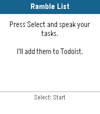

# Todoist Ramble

A Pebble watchapp that lets you dictate tasks by voice and adds them to [Todoist](https://todoist.com) — hands-free, from your wrist.



## What it does

Press Select, speak your tasks naturally, and Todoist Ramble figures out where one task ends and the next begins. Say something like:

> "Pick up groceries, call the dentist, and finish the quarterly report"

and three separate tasks will be added to your Todoist inbox (or a project of your choice).

By default, after dictation the watch shows a scrollable preview of the parsed tasks so you can confirm they look right before anything is sent. Press Select to add them, or Back to cancel.

## Configuration

Settings are managed through the Pebble app on your phone (tap the gear icon next to Todoist Ramble).

| Setting | Required | Description |
|---|---|---|
| **API Token** | Yes | Your Todoist API token. Find it in Todoist under **Settings → Integrations → Developer**. Without this the app cannot add tasks. |
| **Project ID** | No | The numeric ID of the Todoist project to add tasks to. Leave blank to send tasks to your Inbox. You can find a project's ID in its URL when viewed in a browser. |
| **Quick Launch** | No | Skip the idle screen and start listening immediately when the app opens. Useful if you launch the app specifically to dictate. |
| **Skip task preview** | No | Add tasks immediately after dictation without showing the confirmation screen. Useful if you trust the transcription and want the fastest possible flow. |

## How tasks are parsed

Todoist Ramble splits your speech into individual tasks on natural spoken boundaries: the words *and*, *also*, *then*, *next*, commas, periods, and numbered lists. Each resulting fragment is capitalized and leading filler words are stripped. Short fragments and pure stop-words are discarded.

## Installation

> **This app is not currently published to any Pebble app store.** To install it you need to sideload the `.pbw` file directly.

**Prerequisites:** [Rebble](https://rebble.io) account and the Pebble app configured to use the Rebble services (required for dictation).

**Steps:**

1. Clone this repo and install the [Pebble SDK](https://developer.rebble.io/developer.pebble.com/sdk/index.html).
2. From the `todoist-ramble/` directory, run:
   ```
   pebble build
   pebble install --cloudpebble
   ```
   or transfer `build/todoist-ramble.pbw` to your phone and open it with the Pebble app.
3. Open the Pebble app, go to **My Pebble → Todoist Ramble → Settings**, and enter your Todoist API token.

## Supported hardware

Built and tested on **Pebble Time 2 (Emery)**. The app targets all SDK 3 color platforms: Basalt (Pebble Time), Chalk (Pebble Time Round), and Emery (Pebble Time 2).
